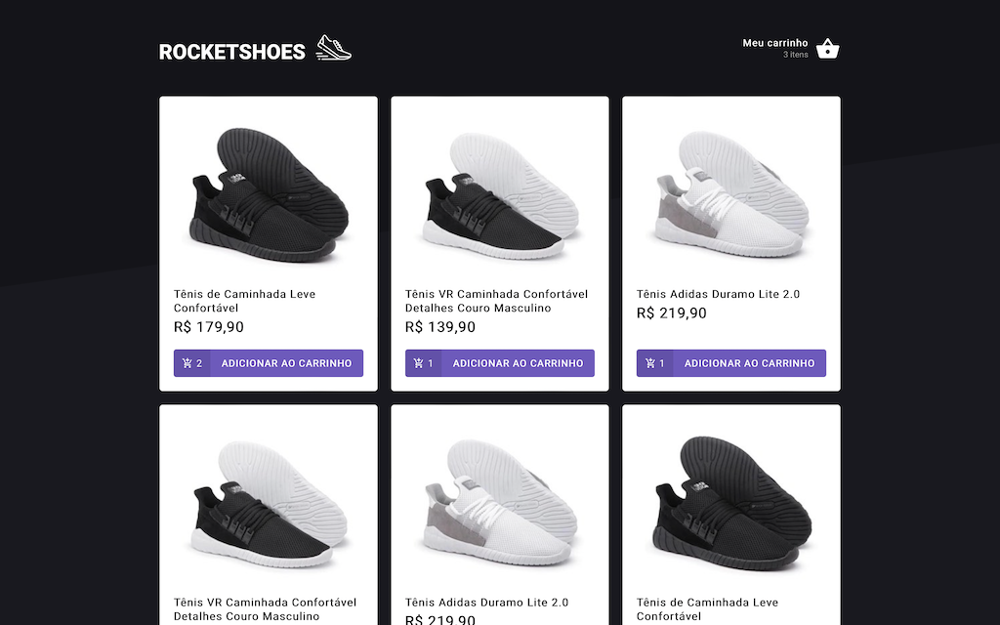
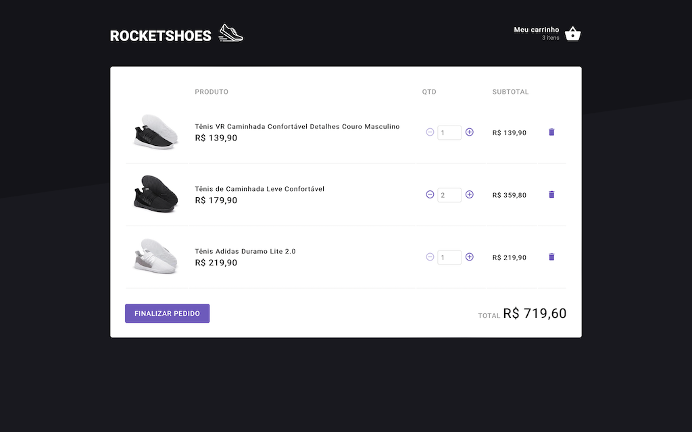

<h1>RocketShoes</h1>

Practice Front-end application to develop a shoes e-commerce.

Developed on Ignite, a Rocketseat program.

## 🚀 Tech

- <b>React</b>
- <b>JSONServer</b>

## 💻 Projeto

  <h4>Features:</h4>
  <ul>
    <li><b>Product Dashboard</b>: You can select the desired item which automatically adds it to the cart and increments the product if it already exists;</li>
    <li><b>Shopping Cart</b>: Keep track of the products selection and its quantity. Calculates the unit and total price.</li>
  </ul>

## 🔖 Layout

<table>
  <tr>
    <td><strong>Dashboard</strong></td>
    <td><strong>Carrinho</strong></td>
  <tr>
   <tr>
    <td></td>
    <td></td>
  <tr>
</table>

## How to run

<li>Install the dependencies running <i>yarn</i> or <i>npm install</i>;</li>
<li>Run <i>yarn server</i> to start the JSONServer mocked API;</li>
<li>Finally run <i>yarn start</i> to start the application;</li>
<li>Optionally you can run <i>yarn test</i> to execute the unit tests.</li>
